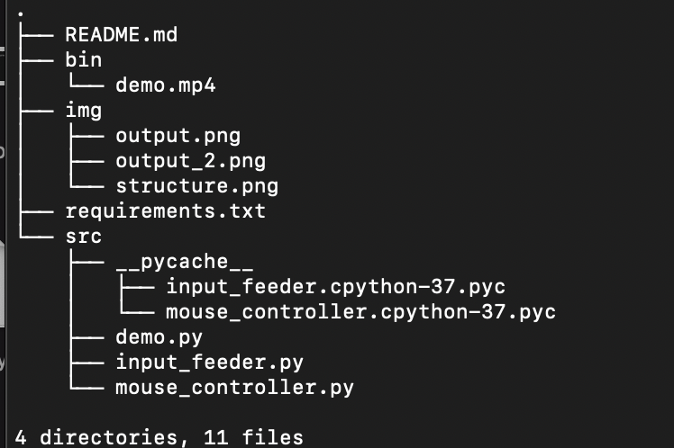
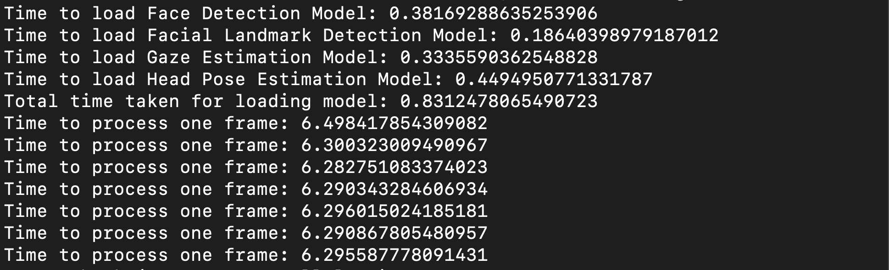
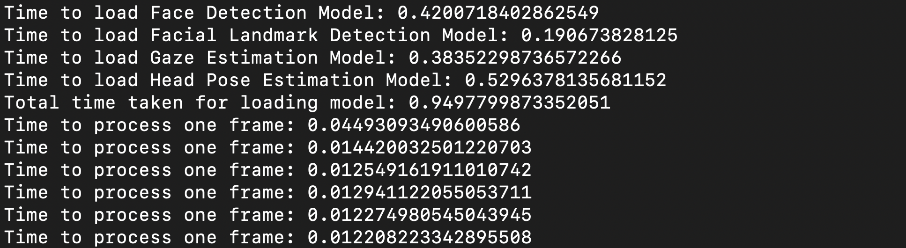

# Computer Pointer Controller

Computer Pointer Controller is an application that helps control the mouse pointer of a computer using the gaze of a person. It uses multiple deep learning based model to achieve desired results. I have built and tested this on Mac but the instructions mentioned below should work for Windows and Ubuntu with few syntax changes.

## Project Set Up and Installation

Install OpenVino Toolkit version 2020.3.194 from [here](https://docs.openvinotoolkit.org/latest/)
Follow the instructions to setup the environment for OpenVino

The setup also requires to download some of the pre-trained deep learning models which can be downloaded using CLI or directly from the OpenVino website.

### Downloading from website:
- [Face Detection Model](https://docs.openvinotoolkit.org/latest/_models_intel_face_detection_adas_binary_0001_description_face_detection_adas_binary_0001.html)
- [Facial Landmarks Detection Model](https://docs.openvinotoolkit.org/latest/_models_intel_landmarks_regression_retail_0009_description_landmarks_regression_retail_0009.html)
- [Head Pose Estimation Model](https://docs.openvinotoolkit.org/latest/_models_intel_head_pose_estimation_adas_0001_description_head_pose_estimation_adas_0001.html)
- [Gaze Estimation Model](https://docs.openvinotoolkit.org/latest/_models_intel_gaze_estimation_adas_0002_description_gaze_estimation_adas_0002.html)

### Downloading using CLI:
* Face Detection Model
```
python "/opt/intel/openvino_2020.3.194/deployment_tools/tools/model_downloader/downloader.py" --name "face-detection-adas-binary-0001"
```

* for landmarks-regression-retail-0009
```
python "/opt/intel/openvino_2020.3.194/deployment_tools/tools/model_downloader/downloader.py" --name "landmarks-regression-retail-0009"
```
* for head-pose-estimation-adas-0001
```
python "/opt/intel/openvino_2020.3.194//deployment_tools/tools/model_downloader/downloader.py" --name "head-pose-estimation-adas-0001"
```

* for gaze-estimation-adas-0002
```
python "/opt/intel/openvino_2020.3.194/deployment_tools/tools/model_downloader/downloader.py" --name "gaze-estimation-adas-0002"
```

## Demo
*Note* If not using the openvino environement already, run the below command before starting the application:
``` 
source /opt/intel/openvinso_2020.3.193/bin/setupvars.sh 
```

### To run the demo

```
python <demo.py directory> 
```

## Documentation
The directory has the following structure:


*Note* The code is set to use webcam for the application but can be used to test on video by passing -i <path to video file> argument. Also, below are the command line arguments that can be used to modify the parameters but are also set to default in the code.
```
  1. -h      : Get the information about all the command line arguments
  2. -fd     : Specify the path of Face Detection model's xml file
  3. -fl     : Specify the path of Facial landmarks Detection model xml file
  3. -hp     : Specify the path of Head Pose Estimation model's xml file
  4. -ge     : Specify the path of Gaze Estimation model's xml file
  5. -i      : Specify the path of input video file or enter cam for taking input video from webcam
  6. -d      : Specify the target device to infer the video file on the model. Suppoerted devices are: CPU, GPU,FPGA (For running on FPGA used HETERO:FPGA,CPU), MYRIAD.
  7. -pt     : Specify the probability threshold for face detection model to detect the face accurately from video frame.
  8. -spd    : Specify the speed of the mouse pointer
  9. -prc    : Specify yhe precission of the mouse pointer
  10. -ctrl  : Specify whether to control mouse or not
  11. -vis   : Specify weather to visualize the output or not
```

## Results

### Model Size

* **face-detection-adas-binary-0001**

| Type         | Size of Model |Time to load   |
|--------------|---------------|---------------|
|  FP32-INT1   |  1.86M        |381.69ms       |

* **head-pose-estimation-adas-0001**

| Type         | Size of Model |Time to load   |
|--------------|---------------|---------------|
|  FP32        |  7.34M        |449.49ms       |

* **landmarks-regression-retail-0009**

| Type         | Size of Model |Time to load   |
|--------------|---------------|---------------|
|  FP32        |  786KB        |186.40ms       |

* **gaze-estimation-adas-0002**

| Type         | Size of Model |Time to load   |
|--------------|---------------|---------------|
|  FP32        |   7.24M       |333.55         |

By running the above application on MacBook with intel core i9 processor and 16gb memory the results were as follow:

The above results shows that it takes a lot of time to control the mouse pointer for just one frame but if we use the inference to only show the output then application is able to process a frame in 120ms.


## Stand Out Suggestions
Make sure to enable the OpenVino enviroment before executing the demo. The firewall may also need to be turned off in some case.

### Edge Cases
1. The lighting matters greatly for the video feed, so sometimes models does not clearly views the gaze.

2. If for some reason model can not detect the face then it throws off track and pointer continues in same direction.

3. If there are more than one face detected in the frame then model takes the first detected face for control the mouse pointer.

4. Some firewall restrictions may not allow the application to control the mouse.

